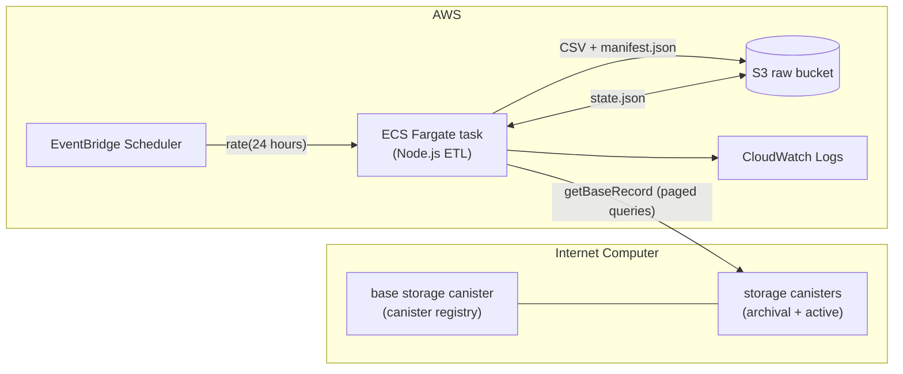

# ICPSwap Extractor

[](https://github.com/RurociagDanych/icpswap-extractor/actions/workflows/ci.yml)

A batch extractor that pulls swap transactions from [ICPSwap](https://app.icpswap.com) storage canisters on the Internet Computer and lands them as raw CSV files in Amazon S3. It runs as a containerized job on AWS Fargate, scheduled with EventBridge, with all infrastructure managed by Terraform.

This is the extract-and-load layer of an ELT approach: data lands raw and immutable per run; transformation and modeling are deliberately left to downstream tooling.

## Architecture



The extractor discovers all storage canisters from the base registry, then:

- **`full` mode** reads every canister (oldest → newest, with bounded concurrency) and writes one CSV per canister.
- **`incremental` mode** reads only the currently active canister, fetching from the last known offset with a configurable overlap window and hash-based deduplication, and handles the moment ICPSwap rotates to a new active canister.

## Key design points

- **Streaming sinks** — rows are streamed to S3 via multipart upload (or to a local file) without buffering whole datasets in memory; every sink tracks row count, byte count, and a SHA-256 checksum as it writes.
- **Run manifest** — every run writes a `manifest.json` with per-file rows/bytes/sha256, enabling downstream completeness checks.
- **Resume state** — per-canister progress (`lastTotal`, recent transaction hashes, `completed` flag) is persisted to `state.json` (S3 or local), so interrupted full loads resume and incremental runs never re-emit known rows.
- **Bounded retries** — all canister queries and S3 state writes use exponential backoff (max 5 attempts).
- **Guarded inputs** — `--page-size` (1..1000), `--concurrency` (1..20), and `--overlap` (>= 0) are validated before anything runs.
- **Least-privilege infra** — the Fargate task role can only read/write objects under its configured S3 prefix; the bucket is private, versioned, encrypted, and TLS-only.

## Reliability & operations

- **Structured logs** — every event is a JSON line (`ts`, `level`, `msg`, `runId`, `mode`, plus context), queryable directly in CloudWatch Logs Insights.
- **Run lock** — a lock object (`<prefix>/locks/run.lock`) is created with an S3 conditional write (`If-None-Match: *`) before any work; a second concurrent run (manual + scheduled overlap) logs a warning and exits cleanly. Locks left behind by killed runs are stolen after a 6-hour TTL.
- **Failure alerting** — an EventBridge rule fires on any task in the cluster stopping with a non-zero exit code (or failing to start) and publishes to an SNS topic; set `alert_email` in `terraform/aws-compute` to subscribe.
- **Lifecycle hygiene** — the raw bucket aborts incomplete multipart uploads after 7 days and expires noncurrent object versions after a configurable window (default 30 days), so versioning doesn't grow storage forever.
- **Anomaly visibility** — a shrinking source canister total (possible reset/migration) is logged as a warning instead of being silently treated as "no new data".

## CLI

| Flag | Default | Description |
| --- | --- | --- |
| `--mode` | `full` | `full` or `incremental` |
| `--page-size` | `1000` | records per canister query (1..1000) |
| `--concurrency` | `5` | parallel canisters in full mode (1..20) |
| `--overlap` | `50` | re-fetch window for incremental dedupe |
| `--s3-bucket` | env `S3_BUCKET` | target bucket; omit for local output |
| `--s3-prefix` | env `S3_PREFIX` or `icpswap` | key prefix in the bucket |
| `--out-dir` | `./out` | local output directory (local mode) |
| `--state-file` | `./out/state.json` | local state path (local mode) |

S3 layout per run:

```
s3://<bucket>/<prefix>/<mode>/<runId>/<nnnn>_<canisterId>.csv
s3://<bucket>/<prefix>/<mode>/<runId>/manifest.json
s3://<bucket>/<prefix>/state/state.json
```

## Run locally

```bash
npm install
npm run dev -- --mode full --page-size 1000 --concurrency 5
npm run dev -- --mode incremental --overlap 50
npm test
```

Local runs write CSVs, `state.json`, a manifest, and a log under `./out/`.

## Deploy to AWS

> Step-by-step instructions — including verification, day-2 operations, and teardown — live in the **[runbook](docs/RUNBOOK.md)**.

Infrastructure is intentionally split into two Terraform roots so compute can be destroyed without touching collected data:

- **`terraform/aws-storage/`** — the persistent raw-data S3 bucket (versioning, SSE, public-access block, TLS-only bucket policy).
- **`terraform/aws-compute/`** — ECR repository, ECS cluster + Fargate task definition, CloudWatch log group, least-privilege IAM roles, and an optional EventBridge schedule.

```bash
# 1. storage
cd terraform/aws-storage
cp terraform.tfvars.example terraform.tfvars   # edit values
terraform init && terraform apply

# 2. compute (set bucket_name from the storage output)
cd ../aws-compute
cp terraform.tfvars.example terraform.tfvars   # edit values
terraform init && terraform apply
```

By default the compute stack uses the account's default VPC for low-friction evaluation; for production set `use_default_vpc = false` and provide dedicated `vpc_id` / `subnet_ids`.

Build, push, and trigger a one-off run with the helper (reads everything from Terraform outputs):

```bash
scripts/aws_build_push_and_run.sh --mode full
scripts/aws_build_push_and_run.sh --mode incremental
scripts/aws_build_push_and_run.sh --build-only
```

Tear down compute while keeping all data:

```bash
cd terraform/aws-compute && terraform destroy
```

## Project layout

```
src/index.ts               entrypoint: discovery + runFull/runIncremental orchestration
src/lib/config.ts          CLI parsing + validation
src/lib/csv.ts             swap transaction -> CSV row mapping
src/lib/csvSink.ts         streaming sinks (local file, S3 multipart) with checksums
src/lib/logger.ts          structured JSON-lines logger
src/lib/retry.ts           bounded exponential-backoff retry
src/lib/state.ts           resume-state schema, parsing, persistence, hash bounds
src/lib/storageTarget.ts   StorageTarget interface: local | S3 (state, sinks, manifest, run lock)
src/idl/                   Candid interfaces for the ICPSwap canisters
tests/                     node:test suites for the pure logic
docs/RUNBOOK.md            local runs, tests, AWS deployment, operations, teardown
terraform/                 aws-storage + aws-compute roots
scripts/                   build/push/run helper for the Fargate task
.github/workflows/         CI: build, tests, terraform fmt/validate
```

## License

[MIT](LICENSE)
